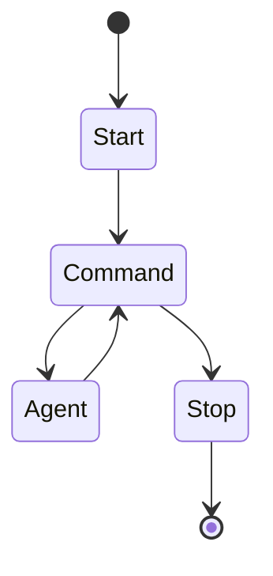

Autoflux
===

A lightweight AI agent framework

> [!WARNING]
> To support common agentic AI workflow, the API will be changed at any time until the design is completed.

## Installation

Install the gem and add to the application's Gemfile by executing:

```bash
bundle add autoflux
```

If bundler is not being used to manage dependencies, install the gem by executing:

```bash
gem install autoflux
```

## Agent Implementations

> [!TIP]
> You may only need an agent to your workflow. The autoflux workflow is designed to multiple agents or multiple states.

* [autoflux-openai](https://github.com/elct9620/autoflux-openai)

## Usage

Autoflux provides a default state machine for a chat workflow.



To start a new workflow use `Autoflux::Workflow`:

```ruby
workflow = Autoflux::Workflow.new(
    agent: agent,
    io: io,
)

workflow.run
```

When the `io` is `EOF`, the workflow will stop.

### Agent

The agent is an object with have `#name` and `#call` methods.

```ruby
require 'autoflux/openai'

agent = Autoflux::OpenAI.new(
    name: "chat",
    model: "gpt-4o-mini"
)
```

The workflow will pass itself as context to the agent.

```ruby
class MyAgent
    attr_reader :name

    def initialize(name:)
      @name = name
    end

    def call(params, workflow:)
      workflow.io.write("Hello, #{params[:name]}!")
    end
end

```

Workflow never knows the how the agent works and which tool is used.

The agent can switch by workflow if the workflow knows it. You can use it in the agent's tool to switch the agent.

```ruby
workflow = Autoflux::Workflow.new(
    agent: agent1, # if not given the first agent in `agents` will be used
    agents: [agent1, agent2],
    io: io,
)

workflow.switch_agent("agent2")
```

### IO

The IO is an adapter to let the workflow interact with the user.

```ruby
# :nodoc:
class ConsoleIO
  def read
    print 'User: '
    gets.chomp
  end

  def write(message)
    puts "Assistant: #{message}"
  end
end
```

The default `Autoflux::Stdio` implement the minimal Standard I/O support.

```ruby
require 'autoflux/stdio'

workflow = Autoflux::Workflow.new(
    agent: agent,
    io: Autoflux::Stdio.new(prompt: '> ')
)

workflow.run
```

## Development

After checking out the repo, run `bin/setup` to install dependencies. Then, run `rake spec` to run the tests. You can also run `bin/console` for an interactive prompt that will allow you to experiment.

To install this gem onto your local machine, run `bundle exec rake install`. To release a new version, update the version number in `version.rb`, and then run `bundle exec rake release`, which will create a git tag for the version, push git commits and the created tag, and push the `.gem` file to [rubygems.org](https://rubygems.org).

## Contributing

Bug reports and pull requests are welcome on GitHub at https://github.com/elct9620/autoflux.

## License

The gem is available as open source under the terms of the [Apache License 2.0](https://opensource.org/licenses/Apache-2.0).
