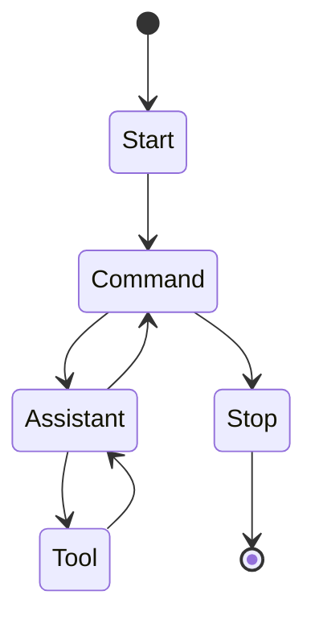

Autoflux
===

A lightweight AI agent framework

> [!WARNING]
> To support common agentic AI workflow, the API will be changed at any time until the design is completed.

## Installation

Install the gem and add to the application's Gemfile by executing:

```bash
bundle add autoflux
```

If bundler is not being used to manage dependencies, install the gem by executing:

```bash
gem install autoflux
```

## Usage

Autoflux provides a default state machine for a chat workflow.



To start a new workflow use `Autoflux::Workflow`:

```ruby
workflow = Autoflux::Workflow.new(
    agent: agent,
    io: io,
)

workflow.run
```

You can give a system prompt when running the workflow:

```ruby
workflow.run(system_prompt: 'Help user to solve the problem')
```

When receive "exit" from the user, the workflow transition to the stop state.

### Agent

The agent is an adapter to the LLM model.

```ruby
# :nodoc:
class OpenAIAgent
  attr_reader :client, :model

  def initialize(client:, model: 'gpt-4o-mini')
    super(tools: tools)
    @client = client
    @model = model
  end

  def call(memory:)
    msg = client.chat(
      parameters: {
        model: model,
        messages: memory.data.map { |event| convert_message(event) },
      }
    ).dig('choices', 0, 'message')

    convert_event(msg)
  end

  # If allow to use the tool, return tool object implements `Autoflux::_Tool` interface
  def tools?(name) = false
  def tool(name) = nil

  # Autoflux use a generic event object to represent the message, you have to convert it to the model's format
  def convert_message(event)
    {
      role: event[:role],
      content: event[:content]
    }.tap do |evt|
      evt[:tool_calls] = event[:invocations]&.map { |invocation| convert_tool_call(invocation) }
      evt[:tool_call_id] = event[:invocation_id] if event[:invocation_id]
    end
  end

  def convert_tool_call(invocation)
    {
      type: :function,
      id: invocation[:id],
      function: {
        name: invocation[:name],
        arguments: invocation[:args]
      }
    }
  end

  def convert_event(msg) # rubocop:disable Metrics/MethodLength
    {
      role: msg['role'],
      content: msg['content'],
      invocations: msg['tool_calls']&.map do |call|
        {
          id: call['id'],
          name: call.dig('function', 'name'),
          args: call.dig('function', 'arguments')
        }
      end
    }
  end
end
```

The memory is history which keep in the workflow. You can decide to use it or not.

### Tool

The tool is a function that can be used in the agent's response.

```ruby
# :nodoc:
class AddToCartTool
  attr_reader :name, :description, :parameters

  def initialize # rubocop:disable Metrics/MethodLength
    @name = 'add_to_cart'
    @description = 'Add the product to the cart'
    @parameters = {
      type: 'object',
      properties: {
        name: { type: 'string', description: 'The name of the product' },
        quantity: { type: 'number', description: 'The quantity of the product' }
      }
    }
  end

  def call(workflow:, params:)
    { success: true, content: "Added #{params[:quantity]} #{params[:name]} to the cart" }
  end
end
```

> You can define how to tell the agent to use the tool by adding `name` and `description` to the tool.

### IO

The IO is an adapter to the input and output.

```ruby
# :nodoc:
class ConsoleIO
  def read
    print 'User: '
    gets.chomp
  end

  def write(message)
    puts "Assistant: #{message}"
  end
end
```

The default `Autoflux::Stdio` implement the minimal Standard I/O support.

```ruby
require 'autoflux/stdio'

workflow = Autoflux::Workflow.new(
    agent: agent,
    io: Autoflux::Stdio.new(prompt: '> ')
)

workflow.run
```

## Development

After checking out the repo, run `bin/setup` to install dependencies. Then, run `rake spec` to run the tests. You can also run `bin/console` for an interactive prompt that will allow you to experiment.

To install this gem onto your local machine, run `bundle exec rake install`. To release a new version, update the version number in `version.rb`, and then run `bundle exec rake release`, which will create a git tag for the version, push git commits and the created tag, and push the `.gem` file to [rubygems.org](https://rubygems.org).

## Contributing

Bug reports and pull requests are welcome on GitHub at https://github.com/elct9620/autoflux.

## License

The gem is available as open source under the terms of the [Apache License 2.0](https://opensource.org/licenses/Apache-2.0).
