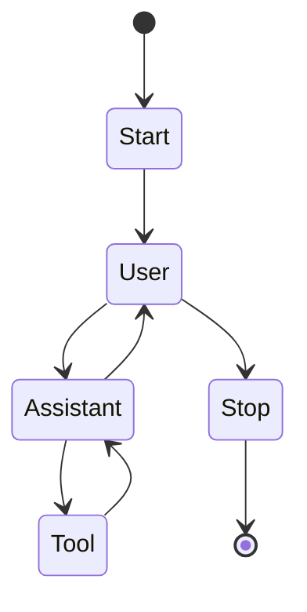

Autoflux
===

A lightweight AI agent framework

> [!WARNING]
> To support common agentic AI workflow, the API will be changed at any time until the design is completed.

## Installation

Install the gem and add to the application's Gemfile by executing:

```bash
bundle add autoflux
```

If bundler is not being used to manage dependencies, install the gem by executing:

```bash
gem install autoflux
```

## Usage

Autoflux provides a default state machine for a chat workflow.



To start a new workflow use `Autoflux::Workflow`:

```ruby
workflow = Autoflux::Workflow.new(
    agent: agent,
    io: io,
)

workflow.run
```

You can give a system prompt when running the workflow:

```ruby
workflow.run(system_prompt: 'Help user to solve the problem')
```

When receive "exit" from the user, the workflow transition to the stop state.

### Agent

The agent is an adapter to the LLM model. You can ihnerit the `Autoflux::Agent` class to implement your own agent.

```ruby
# :nodoc:
class OpenAIAgent < Autoflux::Agent
  attr_reader :client, :model

  def initialize(client:, tools: [], model: 'gpt-4o-mini')
    super(tools: tools)
    @client = client
    @model = model
  end

  def call(memory:)
    client.chat(
      parameters: {
        model: model,
        messages: memory.data,
        tools: tools
      }
    ).dig('choices', 0, 'message')
  end

  def tools
    @tools ||= @_tools.map do |tool|
      {
        type: :function,
        function: {
          name: tool.name,
          description: tool.description,
          parameters: tool.parameters
        }
      }
    end
  end
end
```

The memory is chat history which keep in the workflow. You can decide to use it or not.

### Tool

The tool is a function that can be used in the agent's response. You can ihnerit the `Autoflux::Tool` class to implement your own tool.

```ruby
# :nodoc:
class AddToCartTool < Autoflux::Tool
  def initialize # rubocop:disable Metrics/MethodLength
    super(
      name: 'add_to_cart',
      description: 'Add the product to the cart',
      parameters: {
        type: 'object',
        properties: {
          name: { type: 'string', description: 'The name of the product' },
          quantity: { type: 'number', description: 'The quantity of the product' }
        }
      }
    )
  end

  def call(name:, quantity:, **)
    { success: true, content: "Added #{quantity} #{name} to the cart" }
  end
end
```

The tool is require the name and description. The parameters is optional.

### IO

The IO is an adapter to the input and output. You can ihnerit the `Autoflux::IO` class to implement your own IO.

```ruby
# :nodoc:
class ConsoleIO < Autoflux::IO
  def input
    print 'User: '
    gets.chomp
  end

  def output(message)
    puts "Assistant: #{message}"
  end
end
```

The default `Autoflux::Stdio` implement the minimal Standard I/O support.

```ruby
workflow = Autoflux::Workflow.new(
    agent: agent,
    io: Autoflux::Stdio.new(prompt: '> ')
)

workflow.run
```

## Development

After checking out the repo, run `bin/setup` to install dependencies. Then, run `rake spec` to run the tests. You can also run `bin/console` for an interactive prompt that will allow you to experiment.

To install this gem onto your local machine, run `bundle exec rake install`. To release a new version, update the version number in `version.rb`, and then run `bundle exec rake release`, which will create a git tag for the version, push git commits and the created tag, and push the `.gem` file to [rubygems.org](https://rubygems.org).

## Contributing

Bug reports and pull requests are welcome on GitHub at https://github.com/elct9620/autoflux.

## License

The gem is available as open source under the terms of the [Apache License 2.0](https://opensource.org/licenses/Apache-2.0).
